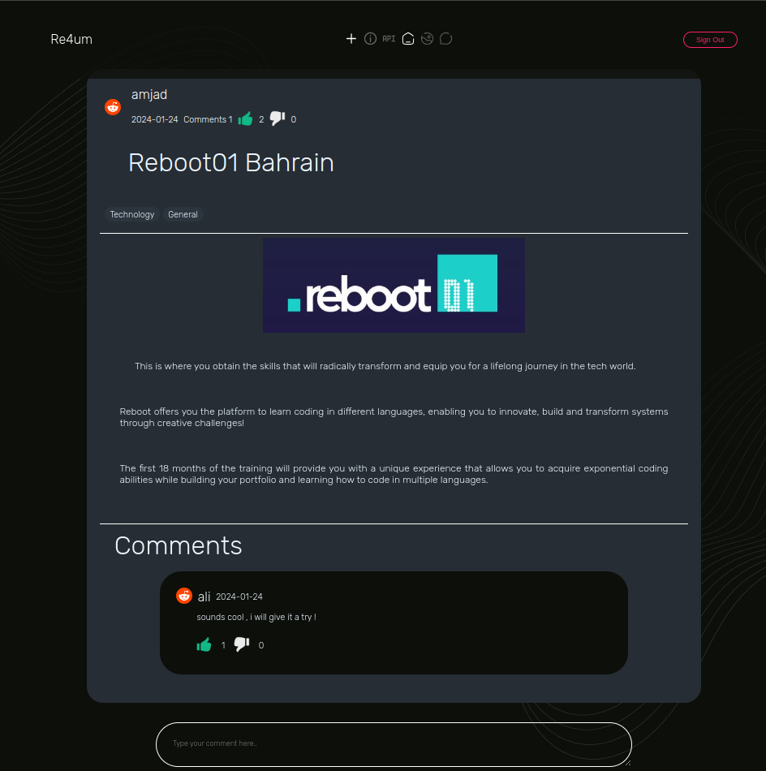
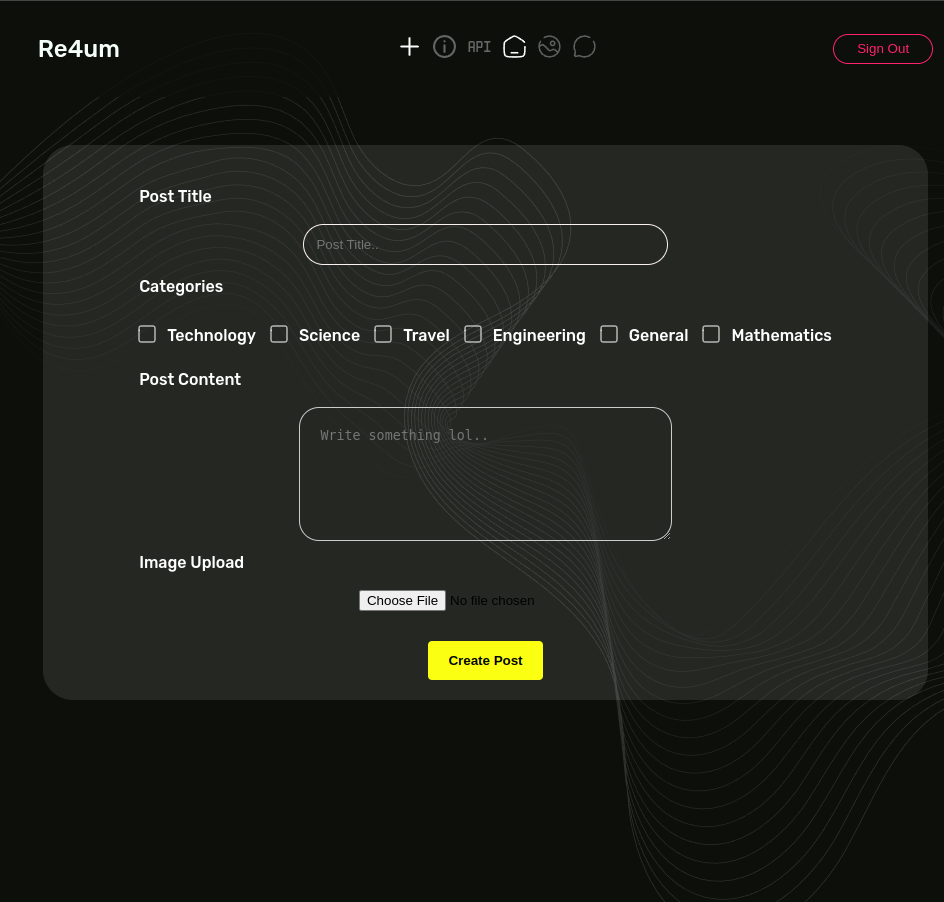

<h1 align="center">Forum "Re4um"</h1>


<p align="center">
    
</p>


<h2 align="">About The Project</h2>

<h4 >
Welcome to our Web Forum Project!

This project is all about building a user-friendly web forum where users can communicate through sharing posts, comments and interact by liking and disliking. We use cool technologies like SQLite for storing data, Docker to keep things organized, and Go to make it all work seamlessly. while also using essential concepts such as session management, encryption, and database manipulation. By adhering to best practices and incorporating essential packages like bcrypt and UUID.

Let's dive in and explore the exciting world of forums, where users connect, share, and engage in meaningful discussions!
</h4>

## Table of Contents

- [Getting Started](#getting-started)
- [Usage](#usage)
- [Directory Structure](#directory-structure)
- [Screenshots](#screenshots)
- [Authors](#authors)

## Getting Started
You can run the Lem-In project with the following command:
```console
git clone https://learn.reboot01.com/git/malsamma/forum
cd forum
```

## Usage
_make sure you are in project directory_

```
go run . cmd/main.go
```
1. Open http://localhost:8080/ in a browser .
2. start going thro the website as a Guest or sign up to continue as user .

### Directory Structure
```console
─ forum/
│
├── api/
│   ├── login.go
│   └── ...
│
├── cmd/
│   └── main.go
│
├── controllers/
│   ├── homepage.go
│   ├── postPage.go
│   └── ... 
│
├── pkgs/
│   ├── funcs/
│   │   ├── category.go
│   │   ├── comment.go
│   │   └── ...
│   │
│   └── hashing/
│       └── hashing.go
│
├── static/
│   ├── myInfo.go
│   ├── myFlags.go
│   └── ...
│
├── static/
│   ├── assets/
│   │   └── ...
│   ├── css/
│   │   └── ...
│   ├── html/
│   │   └── ...
│   └── js/
│       ├── components/
│       │   └── ...
│       ├── helper_funcs/
│       │   └── ...
│       ├── components/
│       │   └── ...
│       ├── createComment.js
│       └── ...
|
├── Dockerfile
├── forum.db
├── go.mod
├── README.md
└── ...
```

## Screenshots
### Home Page
<p align="center">
    
</p>

### Post Page

<p align="center">
    
</p>

### Creat Post
<p align="center">
    
</p>

### Longin & Signup pages
<p align="center">
    
    
</p>


## Instructions
- Just signup and join the Re4um Family.
### To build docker image and run it
- `docker build .`
- `docker run -p 8080:8080 [image_id]`

## Additional information
- The project is written in Go.
- The Database used is SQLite.
- Allowed packages:
    - All standard Go packages.
    - sqlite3 
    - bcrypt
    - UUID

## Contributers
- [sahmedG](https://github.com/sahmedG) (Sameer Goumaa)
- [MSK17A](https://github.com/MSK17A) (Mohammed Alsammak)
- [Emahfoodh](https://github.com/Emahfoodh) (Eman)
- [amali01](https://github.com/amali01) (Amjad Ali)
- [akhaled01](https://github.com/akhaled01) (Abdulrahman Idrees) 
